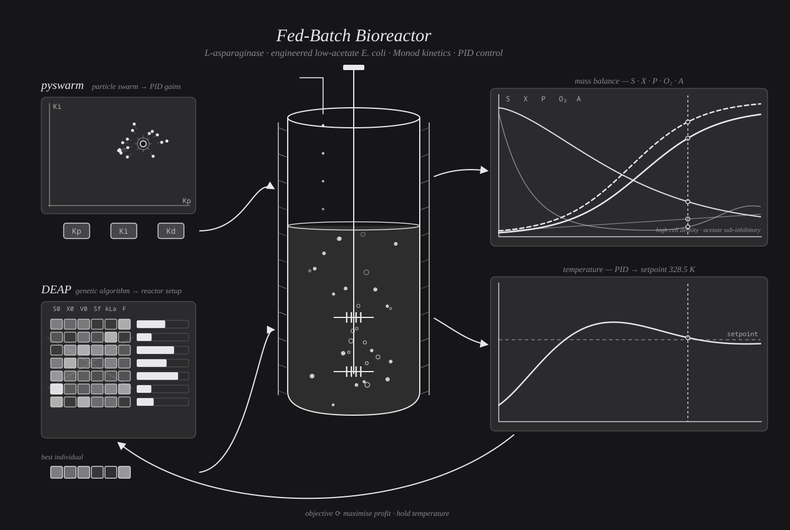

# Fed-Batch Bioreactor Model (Monod + PID)

A Python model of a fed-batch bioreactor that produces L-asparaginase in
engineered *E. coli*. The model couples Monod growth kinetics with mass and
energy balances and a PID controller for temperature. Two optimizers sit on top
of it: a particle swarm (pyswarm) that tunes the PID gains, and a genetic
algorithm (DEAP) that chooses the reactor setup to maximize profit.

Note: -asparaginase was never produced at
bench scale during the project, so several biological and economic values are
informed placeholders rather than measured data. They are clearly marked in the
code. See [Placeholder values](#placeholder-values) before you trust any number.





## How it works

### The reactor model

The state of the culture is tracked over a 24 hour batch: substrate (glucose) S,
biomass X, product (L-asparaginase) P, broth volume V, dissolved oxygen O2,
acetate A, internal energy U, and temperature T.

Growth follows a Monod rate with several limiting and inhibiting factors:

```
mu = mu_max * S/(Ks + S) * (1 - A/Ki_acetic_acid) * (1 - S/Ki_glucose) * O2/(K_o2 + O2)
```

That is, growth is limited by glucose and oxygen, and inhibited by acetate and by
excess glucose. Product forms in proportion to growth (qp = Ypx * mu). Substrate
is consumed for both biomass and product, which keeps the carbon balance closed.
Volume rises at the feed rate F until the vessel is full. Temperature is held at
the setpoint by adjusting the heat-exchanger area through the PID controller.

### The two optimizers

1. **pyswarm (particle swarm)** in `optimize_pid_pyswarm.py` searches for the PID
   gains Kp, Ki, and Kd that hold the temperature closest to the 328.5 K
   setpoint. It minimizes the mean squared error between temperature and
   setpoint over the batch.

2. **DEAP (genetic algorithm)** in `optimize_parameters_deap.py` evolves the
   reactor setup (initial glucose S0, initial biomass X0, initial volume V0, feed
   glucose Sf, oxygen transfer coefficient kLa, and feed rate F) to maximize
   profit. Profit is product revenue minus glucose cost minus seed-culture cost.

## Files

- `bioreactor_model.py`: the reactor model. Running it simulates one batch and
  saves mass-balance and temperature plots.
- `optimize_pid_pyswarm.py`: tunes the PID gains with a particle swarm.
- `optimize_parameters_deap.py`: tunes the reactor setup for profit with a
  genetic algorithm.
- `fedbatch-reactor-loop.html`: the animated diagram (open in a browser).
- `assets/animation-preview.png`: a static frame of the animation.
- `requirements.txt`: Python dependencies.

## Getting started

You need Python 3.8 or newer. Install the dependencies with pip:

```bash
pip install -r requirements.txt
```

A virtual environment is recommended:

```bash
python -m venv .venv
source .venv/bin/activate      # on Windows: .venv\Scripts\activate
pip install -r requirements.txt
```

## Usage

The intended workflow is to optimize first, then run the model with the results.

1. Tune the PID gains:

   ```bash
   python optimize_pid_pyswarm.py
   ```

   This prints the best Kp, Ki, and Kd it found.

2. Tune the reactor setup for profit:

   ```bash
   python optimize_parameters_deap.py
   ```

   This prints the best initial conditions and feed parameters.

3. Copy the values from steps 1 and 2 into the matching variables near the top of
   `bioreactor_model.py`, then run the model:

   ```bash
   python bioreactor_model.py
   ```

   It writes two figures: the mass balance (S, X, P, O2, A over time) and the
   temperature response.

The values are passed by hand on purpose so you can see and check each step.

## Placeholder values

These values are not measured. They stand in for a hypothetical, successfully
engineered strain and for current market pricing, and they are labeled in the
code as placeholders. Replace them with real data before drawing conclusions.

- `Ypx` (enzyme produced per gram of biomass): set to 0.30 for the
  engineered-strain case (strong overexpression, roughly 30 percent of cell
  mass). The original 15.05 value was physically impossible, since it implied
  more product than cell mass.
- `Yps` (enzyme produced per gram of glucose): set to 0.25, used to keep the
  carbon balance closed.
- `Yax` (acetate produced per gram of biomass): lowered to 0.05 to represent a
  low-acetate strain (for example a pta or ackA knockout). At the original 0.92
  the culture poisons itself with acetate and biomass stays near 1.7 g/L. At 0.05
  it reaches a realistic high cell density near 20 g/L. This is the key
  biological lever in the model.
- Product price: set to 1,000,000 dollars per kg. L-asparaginase is a leukemia
  drug, not a commodity enzyme. The formulated drug (for example Oncaspar) runs
  on the order of one million dollars per gram, so this bulk figure is
  deliberately conservative.
- Seed-culture (inoculum) price: set to 50 dollars per kg, a realistic cost.

With the engineered-strain and pricing placeholders in place, the process turns a
profit in the model. With realistic but un-engineered values it does not, which
is the point the project is making: production becomes economical only if the
strain is improved.

## Limitations

- The model prices crude, unpurified product and does not include downstream
  purification cost or yield loss. Real net margins would be lower.
- The placeholder yields and prices drive the headline results and must be
  replaced with measured values for any real claim.
- pyswarm and DEAP are stochastic, so repeated runs give slightly different
  results.

## License

This project is licensed under the MIT License. See the [LICENSE](LICENSE) file.

## Acknowledgments

Thanks to anyone whose code served as inspiration.
